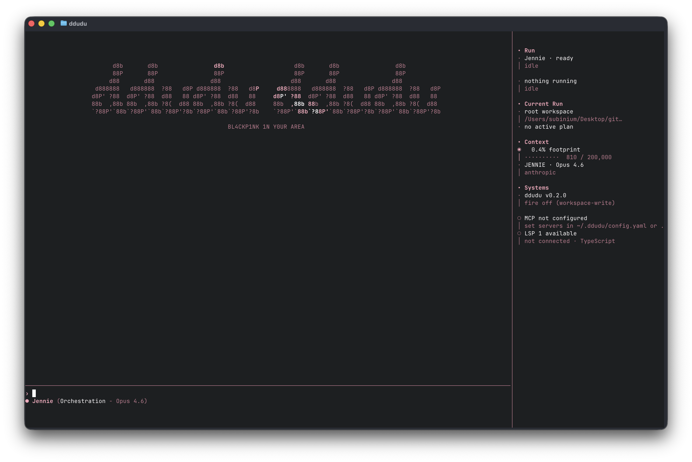

<p align="center">
  
  
  
  
</p>

<p align="center">
  
</p>

<p align="center">
  <em>AI coding harness / BL4CKP1NK 1N Y0UR AREA</em>
</p>

<p align="center">
  
</p>

---

## Current Capabilities

- Native Rust TUI with a TypeScript harness engine
- Canonical sessions with `resume`, `hydrate`, and saved session reopening
- Mode-aware delegation across `JENNIE`, `LISA`, `ROSÉ`, and `JISOO`
- Team orchestration with parallel, sequential, and delegated runs
- Isolated delegated runs with git worktrees for provider-backed agent sessions
- Workflow state with todos, permission profiles, remote provider session state, detached background jobs, and automatic verification
- Sidebar rails for subagents, detached background work, MCP servers, and LSP status
- Context compaction, handoff, briefing, drift checking, and repair escalation
- Skills, hooks, MCP tools, LSP-backed retrieval, git-aware retrieval, and layered memory

## Design Notes

ddudu treats a coding harness as a small operating layer around provider runtimes rather than as a prompt wrapper.

The core system is organized around:

- an execution kernel for provider runtimes, tools, and permissions
- a context engine for retrieval, compaction, memory selection, and handoff
- a session/state layer for canonical transcripts, artifacts, jobs, and checkpoints
- an orchestration layer for routing, delegation, verification, and recovery
- an operator surface for making progress, ownership, and risk legible

The deeper technical notes live in [`docs/`](./docs/):

- [Design Principles](./docs/design-principles.md)
- [Harness Anatomy](./docs/harness-anatomy.md)
- [Context Engine](./docs/context-engine.md)
- [Memory System](./docs/memory-system.md)
- [Session And State](./docs/session-and-state.md)
- [Delegation And Artifacts](./docs/delegation-and-artifacts.md)
- [Trust And Sandbox](./docs/trust-and-sandbox.md)
- [Operator Surface](./docs/operator-surface.md)

## Modes

| Mode     | Provider       | Model               | Role                                      |
| -------- | -------------- | ------------------- | ----------------------------------------- |
| `JENNIE` | Anthropic      | `claude-opus-4-6`   | orchestration, verification, delegation   |
| `LISA`   | OpenAI / Codex | `gpt-5.4`           | fast execution, low-overhead action       |
| `ROSÉ`   | Anthropic      | `claude-sonnet-4-6` | planning, architecture, careful reasoning |
| `JISOO`  | Gemini         | `gemini-2.5-pro`    | design, UI/UX, visual thinking            |

Recommended setup: run this default four-mode lineup together and let ddudu route or delegate between them as needed.

If only one provider is authenticated, ddudu still keeps the four-mode surface and resolves each mode to the best available fallback. In practice that means a Claude-only setup still gives you `Opus 4.6` for orchestration and `Sonnet 4.6` for planning/execution fallbacks, while a Codex-only setup collapses the modes onto `GPT-5.4`.

`Shift+Tab` cycles modes inside the TUI.

## Built-In Tools

| Tool                 | Purpose                                                   |
| -------------------- | --------------------------------------------------------- |
| `read_file`          | read files into the working context                       |
| `write_file`         | create or overwrite files                                 |
| `edit_file`          | patch existing files                                      |
| `list_dir`           | inspect directory contents                                |
| `git_status`         | inspect repository status                                 |
| `git_diff`           | inspect working tree or staged diffs                      |
| `patch_apply`        | validate or apply unified diff patches                    |
| `bash`               | run shell commands                                        |
| `lint_runner`        | run lint/typecheck with structured summaries              |
| `test_runner`        | run tests with structured failure highlights              |
| `build_runner`       | run builds with structured output and summaries           |
| `verify_changes`     | run the harness verification loop over current changes    |
| `grep`               | search file contents                                      |
| `glob`               | match paths by pattern                                    |
| `repo_map`           | render a compact repository tree                          |
| `symbol_search`      | find likely symbol definitions                            |
| `definition_search`  | resolve likely symbol definitions with LSP/heuristics     |
| `reference_search`   | find likely cross-file references and usages              |
| `reference_hotspots` | group likely implementation hotspots by file              |
| `changed_files`      | list git-changed files for active-context retrieval       |
| `file_importance`    | rank likely relevant files for the current request        |
| `codebase_search`    | score files and lines against a natural-language query    |
| `docs_lookup`        | search local repo docs, instructions, and knowledge files |
| `web_search`         | search the web with concise ranked results                |
| `web_fetch`          | fetch and summarize remote pages                          |
| `task`               | delegate work to a sub-agent                              |
| `oracle`             | ask a stronger secondary model for a focused answer       |
| `ask_question`       | pause and request user input inside a run                 |
| `memory`             | read or write persistent memory                           |
| `update_plan`        | manage the shared execution plan / todo list              |

## Installation

Today the supported install path is from source.

Because the TUI is a native Rust binary, a portable `npm install -g ddududdudu` release needs platform-specific packaged binaries first. Until that release pipeline exists, install from source on the target machine.

### Prerequisites

- Node.js `>= 20`
- Rust stable toolchain

### From Source

```bash
npm install
npm run install:global
ddudu
```

`npm run install:global` packs the current checkout and installs that tarball globally, which avoids the live symlink behavior of `npm install -g .` on newer npm versions. This is the recommended source install path.

If you want to run the equivalent steps manually:

```bash
TARBALL="$(npm pack --silent)"
npm install -g "./$TARBALL"
rm "./$TARBALL"
```

If you are developing ddudu itself and explicitly want a live symlink into the current repo, use:

```bash
npm install
npm run build
npm link
```

If you do not want a global install:

```bash
npm install
npm run build
node dist/index.js
```

## Authentication

ddudu can reuse existing provider auth instead of forcing new secrets everywhere.

Supported auth paths today:

- Claude: `claude auth login` or `ANTHROPIC_API_KEY`
- Codex/OpenAI: `codex login` or `OPENAI_API_KEY`
- Gemini: `GEMINI_API_KEY` or `~/.gemini/oauth_creds.json`

Check what ddudu sees:

```bash
ddudu auth
```

Start or refresh login from ddudu:

```bash
ddudu auth login
ddudu auth login claude
ddudu auth login codex
ddudu auth login codex --api-key
```

`ddudu auth login` opens an interactive Arrow-key picker. You can choose a vendor login flow or register an API key in `~/.ddudu/auth.yaml`, depending on the provider.

After login, ddudu rechecks local credentials and shows how the current four-mode lineup resolves against the providers you actually have available.

## Workflow

ddudu keeps one canonical session and layers provider-specific sessions on top of it.

- `session list`, `session last`, and `session resume <id>` reopen saved sessions
- `session pick` opens an interactive saved-session picker with Arrow-key selection
- provider runtimes keep remote session IDs so the harness can `resume` or `hydrate` when context advances
- delegated execution can spin up isolated git worktrees instead of sharing the parent working tree
- background runs can continue as detached workers, keep inspectable job state, and can be retried, promoted, cancelled, or reopened later
- `/plan` and `/todo` manage the shared execution plan
- `/permissions` switches between `plan`, `ask`, `workspace-write`, and `permissionless`, and can pin per-tool, network, and secret trust policies
- direct and delegated execution paths can auto-run review checks, repair retries, and verification summaries
- successful verified runs can promote compact semantic and procedural memory entries automatically
- `/handoff`, `/fork`, `/briefing`, and `/drift` help carry long-running work forward without losing context

## CLI Commands

```bash
ddudu                 # launch TUI
ddudu auth            # show detected auth
ddudu init            # initialize .ddudu/ in current project
ddudu doctor          # basic environment check
ddudu config show     # print merged config
ddudu session list    # list saved sessions
ddudu session pick    # choose a saved session interactively
ddudu session last    # reopen the most recent saved session
ddudu session resume <id>  # reopen a saved session in the native TUI
```

## Benchmarks

WIP.

The current repository includes early benchmark scaffolding, but the task packs and comparison workflow are not stable enough to treat as a polished public feature yet.

## TUI Shortcuts

| Key                      | Action                                     |
| ------------------------ | ------------------------------------------ |
| `Shift+Tab`              | cycle mode                                 |
| `Shift+Enter` / `Ctrl+J` | newline in composer                        |
| `Enter`                  | submit                                     |
| `Esc`                    | interrupt running request / clear composer |
| `Up` / `Down`            | scroll transcript when composer is empty   |
| `PgUp` / `PgDn`          | jump scroll                                |
| `End`                    | follow latest output                       |

## Slash Commands

| Command           | Purpose                                                                                        |
| ----------------- | ---------------------------------------------------------------------------------------------- |
| `/clear`          | clear the current transcript                                                                   |
| `/compact`        | compact canonical context                                                                      |
| `/mode`           | switch active mode                                                                             |
| `/model`          | switch the current mode's model                                                                |
| `/plan`           | show the shared execution plan                                                                 |
| `/todo`           | add, update, or clear plan items                                                               |
| `/permissions`    | change the active permission profile or configure per-tool, network, and secret trust policies |
| `/memory`         | read, write, append, or clear scoped memory                                                    |
| `/session`        | list sessions or resume a saved session                                                        |
| `/config`         | show runtime config summary                                                                    |
| `/help`           | show available commands                                                                        |
| `/doctor`         | show runtime health and context info                                                           |
| `/context`        | inspect the active prompt context snapshot                                                     |
| `/queue`          | inspect, run, promote, drop, or clear queued prompts                                           |
| `/jobs`           | inspect, logs, result, retry, promote, or cancel detached background jobs                      |
| `/artifacts`      | inspect recent typed artifacts                                                                 |
| `/review`         | run review checks against the current diff                                                     |
| `/checkpoint`     | create a git checkpoint commit                                                                 |
| `/undo`           | revert the last ddudu checkpoint                                                               |
| `/handoff`        | compact context into a new handoff session                                                     |
| `/fork`           | fork the current session                                                                       |
| `/briefing`       | generate and save a session briefing                                                           |
| `/drift`          | compare current repo state with the latest briefing                                            |
| `/fire`           | fast toggle permissionless mode                                                                |
| `/init`           | initialize `.ddudu/` files                                                                     |
| `/skill`          | inspect or load skills                                                                         |
| `/hook`           | inspect or reload file-based hooks                                                             |
| `/mcp`            | inspect, add, trust, enable, disable, remove, or reload MCP servers                            |
| `/team`           | run multi-agent orchestration                                                                  |
| `/quit` / `/exit` | exit ddudu                                                                                     |

## License

MIT

---

<p align="center">
  Inspired by <a href="https://github.com/minpeter">minpeter</a> 🍀
</p>
