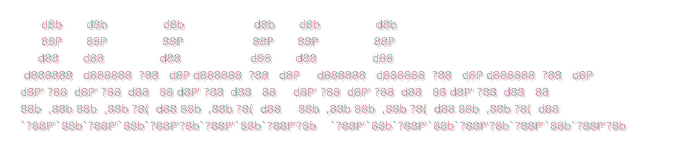

<p align="center">
  
  
  
  
</p>

<p align="center">
  
</p>

<p align="center">
  <em>AI coding harness</em>
</p>

---

## Current Capabilities

- Native Rust TUI with a TypeScript harness engine
- Canonical local sessions with `resume`, `hydrate`, and saved session reopening
- Mode-aware delegation across `JENNIE`, `LISA`, `ROSÉ`, and `JISOO`
- Team orchestration with parallel, sequential, and delegated runs
- Isolated delegated runs with git worktrees for CLI-backed agent sessions
- Workflow state with todos, permission profiles, remote CLI session state, and automatic verification
- Sidebar agent activity rail for delegated runs, task tools, and team workers
- Context compaction, handoff, briefing, and drift checking
- Skills, hooks, MCP tools, git-aware retrieval, and layered memory

## Modes

| Mode     | Provider       | Model               | Role                                      |
| -------- | -------------- | ------------------- | ----------------------------------------- |
| `JENNIE` | Anthropic      | `claude-opus-4-6`   | orchestration, verification, delegation   |
| `LISA`   | OpenAI / Codex | `gpt-5.4`           | fast execution, low-overhead action       |
| `ROSÉ`   | Anthropic      | `claude-sonnet-4-6` | planning, architecture, careful reasoning |
| `JISOO`  | Gemini         | `gemini-2.5-pro`    | design, UI/UX, visual thinking            |

Recommended setup: run this default four-mode lineup together and let ddudu route or delegate between them as needed.

`Shift+Tab` cycles modes inside the TUI.

## Built-In Tools

| Tool           | Purpose                                             |
| -------------- | --------------------------------------------------- |
| `read_file`    | read files into the working context                 |
| `write_file`   | create or overwrite files                           |
| `edit_file`    | patch existing files                                |
| `list_dir`     | inspect directory contents                          |
| `bash`         | run shell commands                                  |
| `grep`         | search file contents                                |
| `glob`         | match paths by pattern                              |
| `repo_map`     | render a compact repository tree                    |
| `symbol_search` | find likely symbol definitions                     |
| `reference_search` | find likely cross-file references and usages       |
| `changed_files` | list git-changed files for active-context retrieval |
| `codebase_search` | score files and lines against a natural-language query |
| `web_fetch`    | fetch and summarize remote pages                    |
| `task`         | delegate work to a sub-agent                        |
| `oracle`       | ask a stronger secondary model for a focused answer |
| `ask_question` | pause and request user input inside a run           |
| `memory`       | read or write persistent memory                     |
| `update_plan`  | manage the shared execution plan / todo list        |

## Quick Start

### Prerequisites

- Node.js `>= 20`
- Rust stable toolchain

### From Source

```bash
npm install
npm run build
npm link
ddudu
```

If you do not want to link globally:

```bash
npm install
npm run build
node dist/index.js
```

## Authentication

ddudu can reuse existing provider auth instead of forcing new secrets everywhere.

Supported auth paths today:

- Claude: `claude auth login` or `ANTHROPIC_API_KEY`
- Codex/OpenAI: `codex login` or `OPENAI_API_KEY`
- Gemini: `GEMINI_API_KEY` or `~/.gemini/oauth_creds.json`

Check what ddudu sees:

```bash
ddudu auth
```

## Workflow

ddudu keeps one canonical local session and layers provider-specific CLI sessions on top of it.

- `session list`, `session last`, and `session resume <id>` reopen saved local sessions
- CLI-backed providers keep remote session IDs so the harness can `resume` or `hydrate` when context advances
- delegated execution can spin up isolated git worktrees instead of sharing the parent working tree
- `/plan` and `/todo` manage the shared execution plan
- `/permissions` switches between `plan`, `ask`, `workspace-write`, and `permissionless`
- direct and delegated execution paths can auto-run review checks and verification summaries
- `/handoff`, `/fork`, `/briefing`, and `/drift` help carry long-running work forward without losing context

## CLI Commands

```bash
ddudu                 # launch TUI
ddudu auth            # show detected auth
ddudu init            # initialize .ddudu/ in current project
ddudu doctor          # basic environment check
ddudu config show     # print merged config
ddudu session list    # list saved sessions
ddudu session last    # reopen the most recent saved local session
ddudu session resume <id>  # reopen a saved local session in the native TUI
```

## TUI Shortcuts

| Key             | Action                                     |
| --------------- | ------------------------------------------ |
| `Shift+Tab`     | cycle mode                                 |
| `Shift+Enter` / `Ctrl+J` | newline in composer               |
| `Enter`         | submit                                     |
| `Esc`           | interrupt running request / clear composer |
| `Up` / `Down`   | scroll transcript when composer is empty   |
| `PgUp` / `PgDn` | jump scroll                                |
| `End`           | follow latest output                       |

## Slash Commands

| Command | Purpose |
| ------- | ------- |
| `/clear` | clear the current transcript |
| `/compact` | compact canonical context |
| `/mode` | switch active mode |
| `/model` | switch the current mode's model |
| `/plan` | show the shared execution plan |
| `/todo` | add, update, or clear plan items |
| `/permissions` | change the active permission profile |
| `/memory` | inspect persistent memory |
| `/session` | inspect local and remote session state |
| `/config` | show runtime config summary |
| `/help` | show available commands |
| `/doctor` | show runtime health and context info |
| `/review` | run review checks against the current diff |
| `/checkpoint` | create a git checkpoint commit |
| `/undo` | revert the last ddudu checkpoint |
| `/handoff` | compact context into a new handoff session |
| `/fork` | fork the current session |
| `/briefing` | generate and save a session briefing |
| `/drift` | compare current repo state with the latest briefing |
| `/fire` | fast toggle permissionless mode |
| `/init` | initialize `.ddudu/` files |
| `/skill` | inspect or load skills |
| `/hook` | inspect loaded hooks |
| `/mcp` | inspect MCP server/tool state |
| `/team` | run multi-agent orchestration |
| `/quit` | exit ddudu |

## Project Layout

Project-level files live under `.ddudu/`.

Typical setup:

```text
.ddudu/
├── config.yaml
├── DDUDU.md
├── memory.md
├── memory/
│   ├── working.md
│   ├── episodic.md
│   ├── semantic.md
│   └── procedural.md
├── hooks/
├── rules/
├── prompts/
├── skills/
└── sessions/
```

User-level state can also live under `~/.ddudu/`.

## License

MIT

---

<p align="center">
  Inspired by <a href="https://github.com/minpeter">minpeter</a> 🍀
</p>
